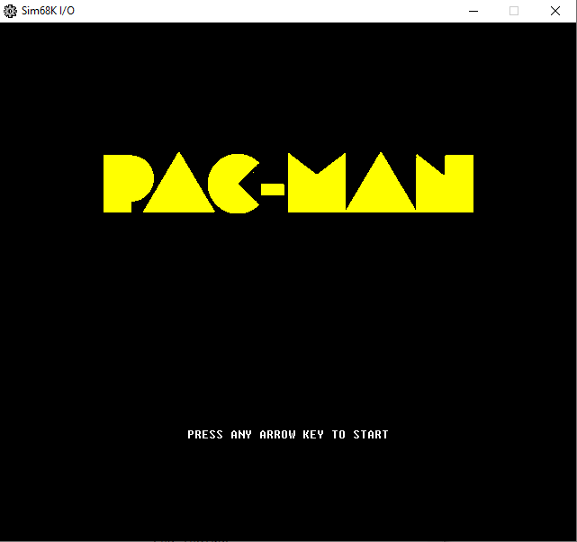
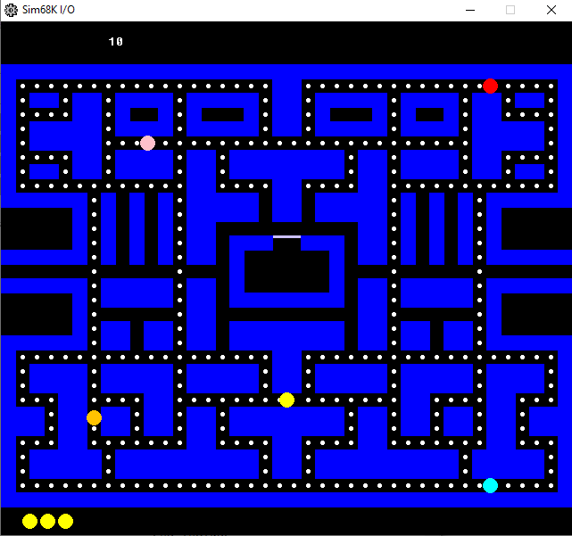

# Pac-Man for Motorola 68000

A faithful recreation of the original arcade Pac-Man, written entirely in Motorola 68000 assembly language for the Sharp X68000 computer. This project aims to replicate the exact logic, ghost behavior, and feel of the original game.

## Overview

This project is a deep dive into retro-programming, utilizing the raw power of the M68K's hardware, BG layers, and FM sound synthesis. It features a modular codebase separating game states, hardware drivers, and semi-AI logic.

### Media

🎥 **[Watch Gameplay Video](DOCS/MEDIA/gameplay.mp4)**

## Game Mechanics & AI Implementation

Unlike the original arcade game, this port implements a simplified AI model where all ghosts share the same fundamental behaviors, differing only in their "Home" corner during Scatter mode.

### Artificial Intelligence
The Ghost AI is built on a shared pathfinding routine (`GHOST_NEXT_MOTION` in `AI.X68`) which determines the optimal direction at any given intersection.

#### Pathfinding Algorithm
1.  **Lookahead**: The ghost checks all 4 possible directions (Up, Down, Left, Right).
2.  **Constraints**:
    *   **Wall Collision**: Uses `AGENT_CAN_MOVE` to verify if the tile is accessible.
    *   **No Reversing**: The algorithm explicitly prohibits moving in the opposite direction of the current travel (e.g., cannot turn Down if currently moving Up).
3.  **Distance Calculation**:
    *   For every valid direction candidates, the ghost simulates moving to the next tile.
    *   It calculates the **Chebyshev distance** from that candidate tile to the **Target Tile**.
    *   The Chebyshev formula used is: `Distance = MAX(|GhostX - TargetX|, |GhostY - TargetY|)`.
4.  **Selection**: The direction that results in the smallest distance to the target is selected.

#### Movement Priorities
If multiple directions offer the exact same distance (highly common with Chebyshev metrics), the code iterates through motions in a fixed order defined in the `MOTIONS` lookup table. This implicitly sets a priority for tie-breaking, ensuring deterministic behavior.

### Ghost Modes
*   **Chase Mode**: All four ghosts (Blinky, Pinky, Inky, Clyde) currently share the **same targeting logic**: they directly target Pac-Man's current tile (`PACMAN_X`, `PACMAN_Y`). The unique personalities (Ambusher, Flanking, etc.) from the arcade version are **not implemented** in this codebase.
*   **Scatter Mode**: Ghosts retreat to fixed corner tiles on the map:
    *   **Blinky**: Top-Right
    *   **Pinky (Speedy)**: Top-Left
    *   **Inky (Bashful)**: Bottom-Left
    *   **Clyde (Pokey)**: Bottom-Right

## Technical Architecture

This project demonstrates a clean, modular approach to 68000 assembly programming.

### 1. Main Loop & Synchronization
The game loop in `MAIN.X68` is designed to be rigorous and consistent. It follows a standard **Input -> Update -> Render** cycle, but with strict V-Sync synchronization:
*   **Cycle Start**: The loop processes all logic (input, states, AI).
*   **Synchronization**: It then enters a busy-wait loop (`.WAIT_INT`) polling `SCREEN_INT_CTR`. This counter is incremented by the Vertical Blanking Interrupt (VBL) handler.
*   **Render**: Once the VBL signal is received, the loop proceeds to `STATE_PLOT` and executes the `SCREEN_TRAP` to update video hardware.
This ensures the game runs at a locked framerate (likely 55Hz/60Hz depending on X68000 video mode) without tearing.

### 2. Finite State Machine
The game flow is managed by a function-pointer based State Machine in `STATES/STATES.X68`.
*   **Structure**: Uses look-up tables (`.INIT_TABLE`, `.UPDATE_TABLE`, `.PLOT_TABLE`) to map state IDs to subroutine addresses.
*   **Transitions**: Changing `STATE_NEXT` triggers the `_INIT` routine of the new state on the next frame, ensuring clean setup (e.g., stopping music, resetting variables) before the new `_UPDATE` logic begins.

### 3. Subsystem Management (TRAPS)
The `SYSTEM` layer abstracts hardware access. Uniquely, this project uses **TRAP instructions** to interface with these drivers, mimicking OS system calls:
*   `TRAP #15`: Standard M68K calls.
*   `TRAP #SCREEN_TRAP`: Flushes the sprite buffer to VRAM.
*   `TRAP #SOUND_TRAP`: Sends commands to the FM sound driver.
*   `TRAP #KEYBOARD_TRAP`: Updates the key state buffer.

### 4. Timing & Interrupts
Game timing (for Ghost mode switching) is decoupled from the frame rate using a dedicated **Timer Interrupt** in `SYSTEM/TIMER.X68`.
*   **Mechanism**: Configures the MFP (Multi-Function Peripheral) Timer to trigger an interrupt every 1 second (`FREQUENCY EQU 1000`).
*   **ISR**: The Interrupt Service Routine (`TIMER_ISR`) simply increments a global `TIMER` word.
*   **Usage**: The `GHOST_UPDATE` routine polls this `TIMER` variable to decide when to switch between **Chase** (20s) and **Scatter** (7s) modes. This ensures game logic speed is independent of rendering performance.

### 5. Data Assets & Rendering
The project handles static data in two distinct ways:

*   **Runtime Loading (Maze)**:
    *   The maze layout is stored in an external binary file `DATA/MAZEDATA.bin`.
    *   `MAZE.X68` uses M68K calls (`TRAP #15` ID `$51` to open, `$53` to read) to load this data into a `MAZEDATA` buffer at runtime (`MAZE_INIT`).
    *   **Rendering**: The `MAZE_PLOT` routine iterates through this buffer. The byte value of each cell serves as an index into a `TEXTURES` lookup table, which points to the pixel logic for that specific tile (wall, pellet, empty).

*   **Assembly Inclusion (Intro Image)**:
    *   The title screen graphic is stored in `DATA/INTRO_IMAGE.bin`.
    *   Unlike the maze, this file is directly embedded into the executable using the assembler directive `INCBIN "DATA/INTRO_IMAGE.bin"` inside `STATES/INTRO.X68`.
    *   **Rendering**: `PLOT_TITLE` decodes this raw binary blob pixel-by-pixel, using `TRAP #15` to plot individual pixels to the screen.

## Project Structure

The codebase is organized into several modules:

*   **`MAIN.X68`**: The main entry point and game loop.
*   **`SYSTEM/`**: Hardware abstraction layer.
    *   `SCREEN.X68`: Sprite and BG plane handling.
    *   `SOUND.X68`: FM sound driver interface.
    *   `KEYBOARD.X68`: Input handling.
*   **`STATES/`**: Finite State Machine processing.
    *   `INTRO.X68`: Title screen and attract mode.
    *   `GAME.X68`: Main gameplay logic.
*   **`GHOST/`**: Individual ghost AI logic.
    *   `BLINKY.X68`, `PINKY.X68`, `INKY.X68`, `CLYDE.X68`.
    *   `AI.X68`: Shared pathfinding and movement routines.
*   **`DATA/`**: Binary data for maps and graphics.
*   **`SOUND/`**: Raw audio samples/data.

## Requirements & Building

*   **Platform**: Motorola 68000 (or emulator like Easy68K).
*   **Assembler**: Designed for standard 68k assemblers (HAS/LK).

To build, ensure your assembler environment is set up and run the build script (e.g., `make` or `batch` file if available) to assemble `MAIN.X68`.

## Credits

*   **Original Game**: Toru Iwatani / Namco (1980).
